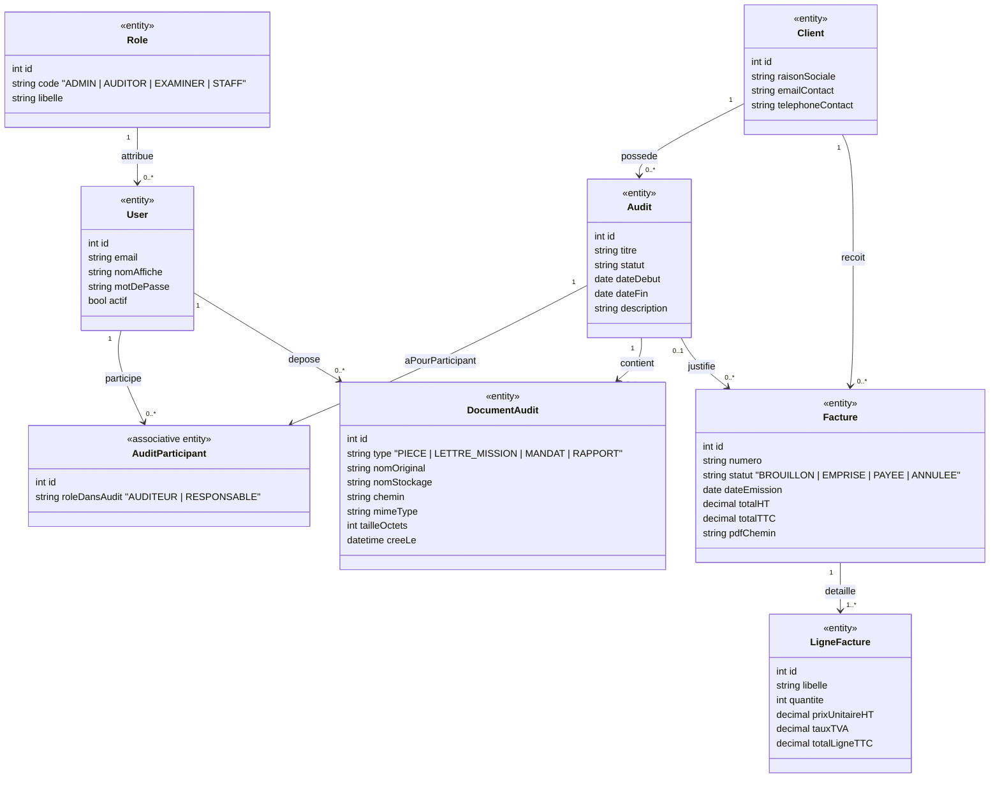

# MCD Cassandre

Pourquoi ce MCD “fonctionne” pour la planification :

- CRUD clients + audits: **Client** et **Audit**
- Auditeur: **Auditor** (plus simple à gérer que du “many-to-many” brut)
- Upload: **DocumentAudit** lié à Audit et à l’utilisateur qui l’a déposé
- Factures: **Facture** + **LigneFacture**, liées à Client (et optionnellement à Audit)
- Rôles et accès: **Role** + **User**

<a href="#">🔝 Retour en haut</a>

