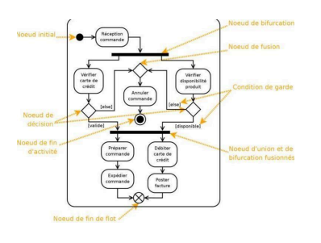

# Diagramme d’activité

Le diagramme d’activité permet de visualiser le comportement interne d’une méthode, d’un
cas d’utilisation … (oui tout est lié)

Il est comme un workflow, il représente l'enchaînement des actions et décisions.

Il ne fait pas état de la collaboration ni du comportement des objets

Il est utile pour représenter les processus métiers et les cas d’utilisation.

On l’utilise en complément des use cases pour apporter du détail et surtout de la précision.

## CE QU’IL COMPREND

- Les activités
o Étapes qui représentent un mécanisme du déroulement de l’action
o Le passage d’une activité à une autre
- Les transitions
o Représentées par des flèches
o Se déclenchent automatiquement à la fin d’une activité



## DESCRIPTION DES ELEMENTS

- Le noeud initial :


```jsx
@startuml
start
@enduml
```

- Le noeud de fin d’activité :


```
@startuml

stop

@enduml
```

- Le noeud de bifurcation | fork :


```
@startuml
start
fork
  :action 1;
fork again
  :action 2;
end merge
stop
@enduml
```

- Le noeud de fusion :


```code
@startuml
start
fork
:action 1;
fork again
:action 2;
fork again
:action 3;
fork again
:action 4;
end merge
stop
@enduml
```

- Le noeud de décision


@startuml
if (color?) is (color:redred) then
:print red;
else
:print not red;
endif
@enduml

- Le noeud de fin de flot


@startuml
start
:Hello world;
:This is on defined on
several **lines**;
end
@enduml

## LES ACTIVITÉS

Elles définissent un comportement décrit par un séquencement organisé d’éléments

Le flot est modélisé par des nœuds et relié par des arcs (transitions)

## REPRÉSENTATION

Les activités sont représentées comme ci-dessous :

```
@startuml
:Hello world;
:This is defined on
several **lines**;
@enduml
```


## LES TRANSITIONS

L'enchaînement des actions et activités est représenté par une flèche.

Une transition se déclenche automatiquement lorsque l’action est terminée

## DECISIONS


```
@startuml

start

if (Graphviz installed?) then (yes)
  :process all\ndiagrams;
else (no)
  :process only
  __sequence__ and __activity__ diagrams;
endif

stop

@enduml
```

On peut représenter les décisions par un losange.
On peut y glisser ou non des détails.
Une décision implique souvent une action

Exemple :


```
@startuml
if (color?) is (<color:red>red) then
:print red;
else
:print not red;
endif
@enduml
```

Les décisions représentent des embranchements à partir desquels les actions suivantes
divergent.
Ici la couleur est rouge : on affiche rouge.
Dans les autres cas, on affiche ‘not red’.
En javascript nous aurions ceci :

```jsx
if(color=='red') {console.log('red')}else{console.log('not red')}
```

Nous comprenons donc qu’en réalisant ce schéma, on a le code ‘presque prêt’ !

Un développeur saura comment traduire cela en code et un commercial comprendra la
vérification réalisée dans ce flow.

## LES JONCTIONS

On peut aussi permettre à différentes branches de se rejoindre.

Nous utilisons donc le losange pour représenter le point de jonction des actions/activités

Toujours dans le même exemple, nous avons les branches séparées lors du choix de la
couleur se rejoignent pour terminer l’exécution du programme.

## LES BIFURCATIONS (FORK)

```
@startuml
start
fork
  :action 1;
fork again
  :action 2;
end fork
stop
@enduml
```


Elles servent à représenter deux actions qui se déroulent en simultané
Elles se rejoignent ensuite

## LES SWIMLANES (Les couloirs)

```
@startuml
|Swimlane1|
start
:foo1;
|#AntiqueWhite|Swimlane2|
:foo2;
:foo3;
|Swimlane1|
:foo4;
|Swimlane2|
:foo5;
stop
@enduml
```


Quand le diagramme a besoin d’impliquer plusieurs acteurs, on les représente sous forme de couloirs (swimlanes).

## DÉBUT, ARRET, FIN

```
@startuml
start
:Hello world;
:This is on defined on
several **lines**;
stop
@enduml
```


On utilise un cercle plein pour indiquer le début de l’application.
Pour désigner l’arrêt de l'activité, c'est le cercle entouré que nous utiliserons.

```
@startuml
start
:Hello world;
:This is on defined on
several **lines**;
end
@enduml
```


Le cercle barré désigne la fin du programme

## ARRET VS FIN

Un arrêt peut intervenir avant la fin d’exécution de l’application.

Il est souvent lié à une décision qui entraîne la fin prématurée de l’application.

Un client qui annule la commande entraîne la fin prématurée avant que l’app n’arrive à la fin
de son traitement.