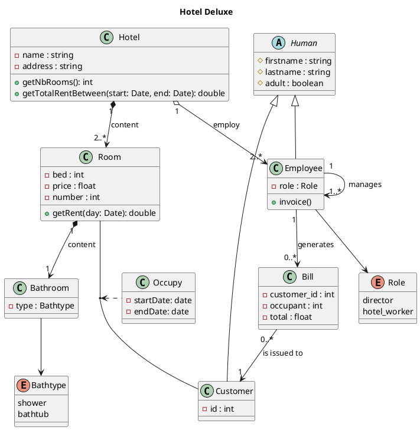

# TP DIAGRAMME DE CLASS : Welcome to the hotel california !!

Un hôtel est composé d'au moins deux chambres

Chaque chambre dispose d'une salle d'eau : douche ou bien baignoire

Un hôtel héberge des personnes.

Il peut employer du personnel et il est impérativement dirigé par un directeur.

On ne connaît que le nom et le prénom des employés, des directeurs et des occupants

Certaines personnes sont des enfants et d'autres des adultes (faire travailler des enfants est interdit).

Un hôtel a les caractéristiques suivantes :

● une adresse,
● un nombre de pièces et une catégorie.

Une chambre est caractérisée par

● le nombre et de lits qu'elle contient,
● son prix
● son numéro.

On veut savoir qui occupe quelle chambre à quelle date.

Pour chaque jour de l'année

on veut pouvoir calculer le loyer de chaque chambre en fonction de son prix et de son occupation (le loyer est nul si la chambre est inoccupée).

La somme de ces loyers permet de calculer le chiffre d'affaires de l'hôtel entre deux dates.

**Question : Donnez une diagramme de classes pour modéliser le problème de l'hôtel.**

