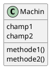
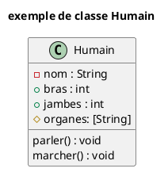
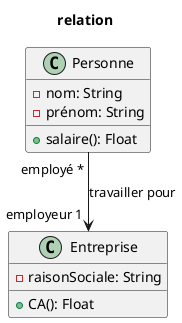
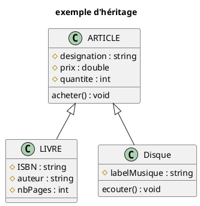
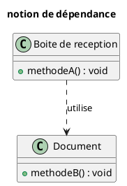
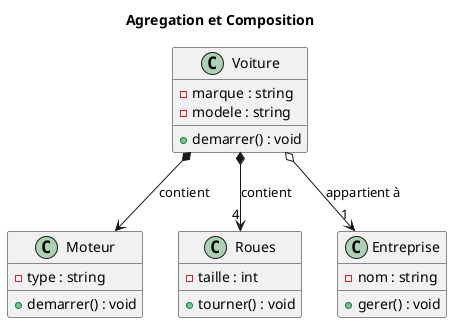
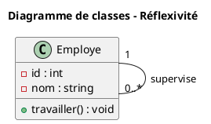
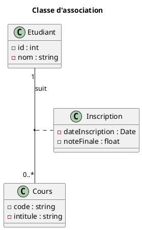

# DIAGRAMME DE CLASS

## PRÉSENTATION

Il sert à décrire la structure et les liens entre les composants du système

Il représente les différentes briques du logiciel.

## LES CLASSES

Décrit un ensemble d’objets qui ont en commun :

- Une sémantique
- Des attributs
- Des méthodes
- Des relations

```code
@startuml
class Machin {
 champ1
 champ2
 methode1()
 methode2()
}
@enduml
```



Une class se compose donc d’un nom, d’attributs et de méthodes.

## LES ATTRIBUTS

```code
@startuml
class Machin {
 champ1
 champ2
 methode1()
 methode2()
}
@enduml
```


Les attributs  définissent les paramètres de notre Objet/Classe

## PORTÉE DES ATTRIBUTS

```code
@startuml exemple
title exemple de classe Humain
class Humain {
    - nom : String
    + bras : int
    + jambes : int
    # organes: [String]
    parler() : void
    marcher() : void
}
@enduml
```



Les attributs peuvent avoir une portée :
● Private : -
● Public : +
● Protected : #

## TYPAGE DES ATTRIBUTS

On peut également indiquer le typage des attributs :
● String
● Integer
● []
● Boolean…

## LES OPÉRATIONS / MÉTHODES

On précise en bas du bloc les opérations que peuvent réaliser les objets de cette classe. Si la
méthode entraîne un retour, on peut préciser son type ou les paramètres dont il a besoin.

## LES TYPES DE RELATIONS

On distingue plusieurs types de relations :
● Association
● Héritage
● Dépendance
● Agrégation
● Réflexive

## CARACTÉRISTIQUE D’UNE RELATION

```code
@startuml relation
title relation

class Personne{
    -nom: String
    -prénom: String
    +salaire(): Float
}

class Entreprise{
    -raisonSociale: String
    +CA(): Float
}

Personne "employé *" --> "1 employeur" Entreprise : travailler pour

@enduml
```



Les caractéristiques sont applicables à n’importe quel type de relation
On retrouve de chaque côté un intitulé (rôle)
Un nombre / étoile correspond à une cardinalité
On va représenter le type d’association (apparence de la flèche)
Que pouvons nous comprendre de la connexion ci-dessus ?
Nous avons ici une personne peut travailler pour un employeur
● Caractérisé par le ‘1’ à côté de Entreprise
Un employeur peut employer plusieurs personnes

- Caractérisé par le « * » à côté de la classe Personne

Nous indiquons que ‘Entreprise’ est ‘employeur’ de ‘Personne’.
Lorsqu’on constitue notre BDD à partir du diagramme, on sous-entend que
‘Personne ‘ aura un attribut ‘Employeur’.
Nous indiquons que ‘Personne ‘ est ‘employé’ de ‘Entreprise’
De même , un employeur aura un attribut ‘employés’ qui contiendra une liste de
personnes.
On peut aussi préciser la valeur minimale d’une cardinalité comme suit : « 1..* »
Ce qui signifie que l’on peut avoir entre 1 et * éléments dans la liste.

## LA RELATION D'HÉRITAGE

```code
@startuml exemple
title exemple d'héritage
class ARTICLE {
    # designation : string
    # prix : double
    # quantite : int
    acheter() : void
}
class LIVRE {
    # ISBN : string
    # auteur : string
    # nbPages : int
}
Class Disque {
    # labelMusique : string
    ecouter() : void
}
ARTICLE <|-- Disque
ARTICLE <|-- LIVRE
@enduml
```



Lorsqu’une classe hérite d’une autre, on dit qu’elle étend de cette dernière.
En programmation orientée Objet on utilisera le mot ‘extends’ :
Exemple :

```php
class Livre extends Article
{
    
}
```

Quels seront donc les attributs de la classe ‘livre’ ?

- designation
- prix
- quantite
- ISBN
- auteur
- nbPages

C’est ici que la portée des attributs aura une importance : Déterminant ce qui pourra être
hérité ou non.

## LA RELATION DE DÉPENDANCE

```code
@startuml
title notion de dépendance
class "Boite de reception" as BoiteDeReception {
    +methodeA() : void
}
class Document {
    +methodeB() : void
}
BoiteDeReception ..> Document : utilise

@enduml
```



Elle est exprimée par une flèche pointillée.
Elle indique une dépendance d’un objet par rapport à l’autre.
Elle représente quel type d’objet une classe peut contenir
Nous avons dans le diagramme de classe ci-dessus, la boite de réception contiendra des
objets ‘document’(mails)

## LA RELATION D'AGRÉGATION / COMPOSITION

```code
@startuml AgregationComposition
title Agregation et Composition
class "Voiture" {
    -marque : string
    -modele : string
    +demarrer() : void
}
class "Moteur" {
    -type : string
    +demarrer() : void
}
class "Roues" {
    -taille : int
    +tourner() : void
}
class "Entreprise" {
    -nom : string
    +gerer() : void
}
Voiture *--> Moteur : contient
Voiture *--> "4" Roues : contient
Voiture o--> "1" Entreprise : appartient à
@enduml
```



Dans le diagramme, la différence se voit directement sur le type de losange de la relation.

1. Composition (losange plein `--`)
- Relations :
    - Voiture *-- Moteur : contient
    - Voiture *-- "4" Roues : contient
- Sens :
    - Le tout (Voiture) possède fortement ses parties (Moteur, Roues).
    - Les parties n’ont pas de sens seules dans ce modèle.
    - Si la Voiture “disparaît”, on considère que ses parties disparaissent avec elle (cycle de vie lié).
1. Agrégation (losange vide `o--`)
- Relation :
    - Voiture o-- "1" Entreprise : appartient à
- Sens :
    - Lien plus faible entre objets.
    - Entreprise existe indépendamment de Voiture.
    - Une Voiture peut changer d’Entreprise sans “détruire” l’Entreprise (cycle de vie indépendant).

Lecture rapide du modèle :

- Voiture est composée de 1 Moteur et 4 Roues.
- Voiture est agrégée à 1 Entreprise (propriétaire/gestionnaire), mais Entreprise ne dépend pas de l’existence d’une Voiture.

## RELATION RÉFLEXIVE :

```code
@startuml
title Diagramme de classes - Réflexivité
class "Employe" as Employe {
    -id : int
    -nom : string
    +travailler() : void
}

Employe "1" -- "0..*" Employe : supervise
@enduml
```



Elle indique que la classe peut / a une relation avec elle-même.
Ici nous avons un employé qui supervise des employés.
On s’en sert pour désigner les classes où chaque objet ne joue pas le même rôle.

## LA RELATION DE CLASSE ASSOCIATION :

Elle sert à indiquer des informations propres à la relation entre les classes.

```code
@startuml
title Classe d'association

class Etudiant {
	-id : int
	-nom : string
}

class Cours {
	-code : string
	-intitule : string
}

Etudiant "1" -- "0..*" Cours : suit

class Inscription {
	-dateInscription : Date
	-noteFinale : float
}

(Etudiant, Cours) .. Inscription

@enduml
```



1. Les classes principales
- Etudiant les attributs id et nom.
- Cours avec les attributs code et intitule.
- Inscription qui stocke les informations de la relation (dateInscription, noteFinale).

1. L’association Etudiant-Cours
- Sens métier: un Etudiant suit des Cours.

1. La classe d’association
- (Etudiant, Cours) .. Inscription signifie que Inscription appartient à la relation entre Etudiant et Cours, pas à une seule classe.
- Donc dateInscription et noteFinale décrivent le lien Etudiant-Cours.

1. Point important sur les multiplicités
- Avec Etudiant "1" -- "0..*" Cours:
- Un Etudiant peut avoir 0 à plusieurs Cours.
- Un Cours est lié à exactement 1 Etudiant.
- Si tu voulais un vrai plusieurs-à-plusieurs (cas le plus fréquent avec une inscription), il faut mettre 0..* des deux côtés.