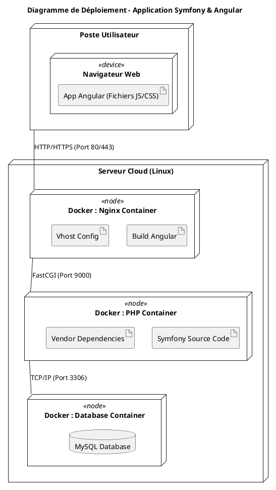

# Le diagramme de déploiement

## 1. Qu'est-ce qu'un Diagramme de Déploiement ?

Le diagramme de déploiement (UML) sert à décrire la **configuration physique** du matériel et des logiciels qui composent votre système. Il répond à la question : *"Où mon code va-t-il être installé et comment les machines communiquent-elles entre elles ?"*

### Les concepts clés :

- **Le Nœud (Node) :** Représente une ressource matérielle ou logicielle (un serveur, un ordinateur, un conteneur Docker).
- **L'Artéfact (Artifact) :** C'est le fichier concret (votre code compilé, un `.jar`, un dossier `dist/`, un binaire).
- **Le Chemin de communication :** Les lignes reliant les nœuds (souvent avec le protocole utilisé : HTTP, TCP/IP, SSH).

## 2. Architecture de notre exemple

Pour une application **Angular** (Frontend) et **Symfony** (Backend), nous allons modéliser une infrastructure classique utilisant Docker pour la conteneurisation.

- **Client :** Le navigateur de l'utilisateur.
- **Serveur Web :** Un serveur Nginx qui héberge les fichiers statiques d'Angular.
- **Serveur d'Application :** Un moteur PHP qui exécute le code Symfony.
- **Base de données :** Un serveur MySQL

## 3. Exemple avec PlantUML

Voici le code pour générer ce diagramme. Vous pouvez le copier-coller dans n'importe quel éditeur PlantUML.

```code
@startuml
title Diagramme de Déploiement - Application Symfony & Angular

node "Poste Utilisateur" {
    node "Navigateur Web" <<device>> {
        artifact "App Angular (Fichiers JS/CSS)" as angular_art
    }
}

node "Serveur Cloud (Linux)" {
    
    node "Docker : Nginx Container" <<node>> {
        artifact "Build Angular" as dist
        artifact "Vhost Config" as vhost
    }

    node "Docker : PHP Container" <<node>> {
        artifact "Symfony Source Code" as symfony_code
        artifact "Vendor Dependencies" as vendor
    }

    node "Docker : Database Container" <<node>> {
        database "MySQL Database" as db
    }
}

' Relations de communication
"Poste Utilisateur" -- "Docker : Nginx Container" : HTTP/HTTPS (Port 80/443)
"Docker : Nginx Container" -- "Docker : PHP Container" : FastCGI (Port 9000)
"Docker : PHP Container" -- "Docker : Database Container" : TCP/IP (Port 3306)

@enduml
```



## 4. Explication du Diagramme

### L'interaction client-serveur

L'utilisateur n'accède qu'au **Nginx**. C'est le point d'entrée unique. Si l'utilisateur demande une page, Nginx lui envoie les fichiers Angular.

### Le dialogue Frontend/Backend

Contrairement à une idée reçue, dans ce schéma, le navigateur de l'utilisateur fait des requêtes API directement vers le serveur.

- **Angular** tourne dans le navigateur de l'utilisateur.
- Il appelle le serveur via des requêtes **REST**.

### La séparation des préoccupations

- **Nginx** s'occupe du statique.
- **PHP-FPM** ne s'occupe que du calcul (le PHP).
- **MySQL** ne s'occupe que du stockage.

> **Note importante :** En production, on utilise souvent un "Reverse Proxy" supplémentaire ou un "Load Balancer" devant Nginx pour gérer la sécurité et la charge.
>