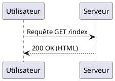
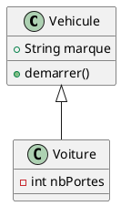
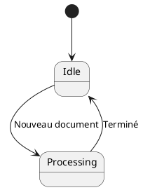

# Utiliser PlantUML dans VS Code

## 1. Prérequis

Pour que PlantUML fonctionne localement, vous avez besoin de trois éléments :

1. **Java Runtime Environment (JRE) :** PlantUML est écrit en Java (Open-JRE installé par défaut sur linux).
2. **Graphviz :** Logiciel requis pour générer la plupart des diagrammes (sauf les diagrammes de séquence).
3. **L'extension VS Code :** "PlantUML" par Jebbs.

## 2. Installation étape par étape

### Étape 1 : Installer Java

Vérifiez si Java est installé en tapant `java -version` dans votre terminal. Sinon, téléchargez-le sur le site officiel d'Oracle ou utilisez un gestionnaire de paquets (Homebrew, Winget).

### Étape 2 : Installer Graphviz

```bash
sudo nala install -y graphviz
```

Et on installe `plantuml`

```bash
sudo bash -c "curl -L https://raw.githubusercontent.com/metanorma/plantuml-install/main/ubuntu.sh | bash"
```

Dans le `settings.json` de VSC

```json
"plantuml.server": "https://www.plantuml.com/plantuml",
```

Pour l'instant je n'ai pas réussie à utiliser le rendu local avec plantuml installé sur ma machine, à voir une autre fois.

### Étape 3 : Installer l'extension VS Code

1. Ouvrez VS Code.
2. Allez dans l'onglet **Extensions** (`Ctrl+Shift+X`).
3. Recherchez **"PlantUML"** (par Jebbs `jebbs.plantuml`) et cliquez sur **Installer**.

---

## 3. Utilisation de base

### Créer un fichier

Créez un nouveau fichier avec l'extension `.puml` ou `.wsd`.

### Structure d'un diagramme

Tout diagramme doit commencer par `@startuml` et se terminer par `@enduml`.

**Exemple de diagramme de séquence :**

Extrait de code



---

## 4. Raccourcis et Astuces

| **Action**                     | **Raccourci**                                           |
| ------------------------------ | ------------------------------------------------------- |
| **Aperçu du diagramme**        | `Alt + D`                                               |
| **Exporter le diagramme**      | `Ctrl + Shift + P` > `PlantUML: Export Current Diagram` |
| **Choisir le format d'export** | (PNG, SVG, PDF) dans les paramètres de l'extension      |

> [!TIP]
>
> **Le serveur de rendu :** Si vous ne voulez pas installer Java ou Graphviz localement, vous pouvez configurer l'extension pour utiliser un serveur public. Allez dans les réglages de l'extension et remplacez `Local` par `PlantUMLServer` dans l'option **Render**.

---

## 5. Exemples de syntaxe commune

### Diagramme de Classes

Extrait de code



### Diagramme d'État

Extrait de code


