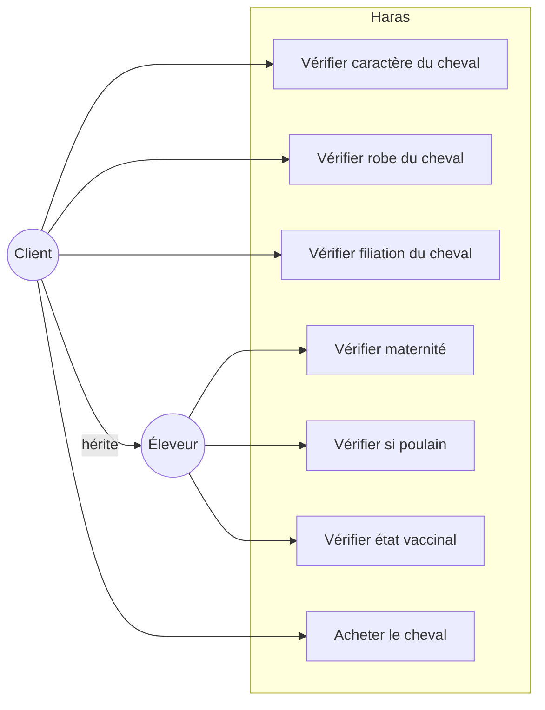

# Test mermaid exo cheval

```mermaid
flowchart LR

Client((Client))
Eleveur((Éleveur))

Client -->|hérite| Eleveur

subgraph Haras
  VC[Vérifier caractère du cheval]
  VR[Vérifier robe du cheval]
  VF[Vérifier filiation du cheval]
  VM[Vérifier maternité]
  VP[Vérifier si poulain]
  VV[Vérifier état vaccinal]
  ACH[Acheter le cheval]
end

Client --> ACH
Client --> VC
Client --> VR
Client --> VF

Eleveur --> VM
Eleveur --> VP
Eleveur --> VV
```

En espérant que ce soit bon.
