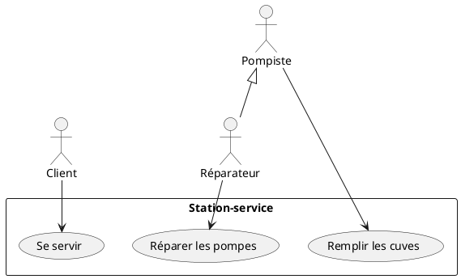

# test puml

```puml
@startuml station-essence
skinparam PackageStyle rectangle

actor Client
actor Pompiste
actor Réparateur
Pompiste <|-- Réparateur

package "Station-service" {
  (Se servir)
  (Remplir les cuves)
  (Réparer les pompes)
}

Client --> (Se servir)
Pompiste --> (Remplir les cuves)
Réparateur --> (Réparer les pompes)

@enduml
```
