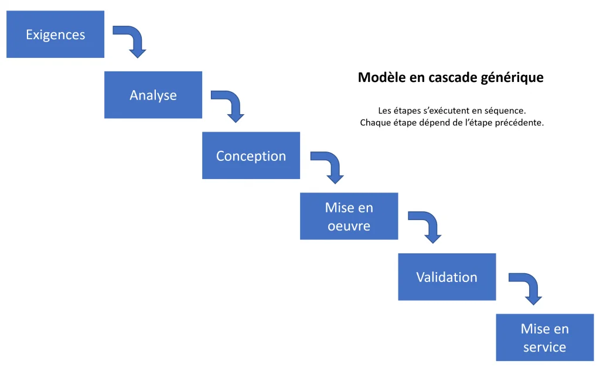

# Les Méthodes Agiles

# Documentation : Méthodologies de Gestion de Projet Logiciel

## 1. Approches Traditionnelles et Séquentielles

### ● WATERFALL (Cascade)

Le modèle le plus ancien. Chaque phase (Analyse, Design, Code, Test, Déploiement) doit être terminée avant de passer à la suivante.

- **Avantage :** Structure rigide et prévisible.
- **Inconvénient :** Très peu de flexibilité face aux changements en cours de route.

Source : [https://blog-gestion-de-projet.com/modele-en-cascade/](https://blog-gestion-de-projet.com/modele-en-cascade/)

### ● CYCLE EN V

Une évolution du Waterfall qui met l'accent sur la vérification et la validation. À chaque étape de conception (branche descendante) correspond une étape de test (branche ascendante).

- **Lien direct :** Les tests unitaires valident le codage, les tests d'intégration valident la conception technique, etc.

[V-Model software development lifecycle, généré par IA](https://encrypted-tbn2.gstatic.com/licensed-image?q=tbn:ANd9GcRXU5J-ZBo31VDNeJoHoxEFhmZlx4nKB6sk1ADHWQ2TMqyHqcD_sXRk8wK0IyOPOvakZvQ-NK_eoletdtymDZQRvgtBdiiTieHZLYCe1ryoHPVlXx4)

Shutterstock

Explorer

---

## 2. L'Agilité et ses Fondations

### ● 12 PRINCIPES DE L’AGILE

Les principes agiles visent à placer l'humain et la valeur métier au centre du développement logiciel. Ils se décomposent en quatre grandes thématiques :

### 1. La Satisfaction Client et la Livraison

1. **Priorité à la satisfaction du client :** Satisfaire le client en livrant rapidement et régulièrement des fonctionnalités à grande valeur ajoutée.
2. **Livraisons fréquentes :** Livrer un logiciel opérationnel toutes les deux semaines à deux mois, avec une préférence pour les cycles les plus courts.
3. **Logiciel opérationnel comme mesure :** Un logiciel qui fonctionne est la principale mesure d'avancement du projet (plus que la documentation ou les prévisions).

### 2. L'Ouverture au Changement

1. **Accueillir le changement :** Accepter les changements de besoins, même tard dans le développement. Les processus agiles exploitent le changement pour donner un avantage compétitif au client.

### 3. La Collaboration Humaine

1. **Travail conjoint quotidien :** Les utilisateurs (ou représentants métier) et les développeurs doivent travailler ensemble quotidiennement tout au long du projet.
2. **Équipes motivées :** Construire les projets autour d'individus motivés. Donnez-leur l'environnement et le soutien dont ils ont besoin, et faites-leur confiance pour atteindre les objectifs.
3. **Communication en face à face :** La méthode la plus efficace pour transmettre des informations est la conversation en face à face (ou par vidéo directe).

### 4. L'Excellence Technique et l'Auto-organisation

1. **Rythme de travail soutenable :** Les processus agiles encouragent un rythme de développement soutenable. Les commanditaires, les développeurs et les utilisateurs devraient pouvoir maintenir un rythme constant indéfiniment.
2. **Attention continue à l'excellence :** Une attention continue à l'excellence technique et à une bonne conception (design) renforce l'agilité.
3. **Simplicité :** La simplicité est essentielle. C'est l'art de maximiser la quantité de travail *qu'on ne fait pas* (éviter le "superflu").
4. **Auto-organisation :** Les meilleures architectures, spécifications et conceptions émergent d'équipes qui s'auto-organisent.
5. **Amélioration continue :** À intervalles réguliers, l'équipe réfléchit aux moyens de devenir plus efficace, puis règle et modifie son comportement en conséquence (c'est l'essence de la **Rétrospective**).

### ● RAD (Rapid Application Development)

Méthode axée sur la vitesse et le prototypage. Elle implique fortement l'utilisateur final dès le début pour affiner les besoins par itérations successives de maquettes.

Source : [https://moreauva.scenari-community.org/MP_04-MethodesAgiles_web/co/agiUL16agi.html](https://moreauva.scenari-community.org/MP_04-MethodesAgiles_web/co/agiUL16agi.html)

### ● DSDM (Dynamic Systems Development Method)

Une méthode agile qui se concentre sur la livraison de solutions business dans des délais et budgets fixes, en utilisant la priorisation (souvent via la méthode MoSCoW).

Source : [https://www.knowledgetrain.co.uk/agile/agile-project-management/agile-project-management-course/dsdm-principles](https://www.knowledgetrain.co.uk/agile/agile-project-management/agile-project-management-course/dsdm-principles)

### ● FDD (Feature Driven Development)

Une approche centrée sur les fonctionnalités. Le développement est organisé autour de "features" que l'on peut concevoir et construire en moins de deux semaines.

Source : [https://www.tatvasoft.com/outsourcing/2023/12/feature-driven-development.html](https://www.tatvasoft.com/outsourcing/2023/12/feature-driven-development.html)

### ● XP (Extreme Programming)

L'**Extreme Programming** est une méthodologie agile centrée sur l'excellence technique et la réactivité. Son principe : "Si une pratique est bonne, poussons-la à l'extrême."

**1. L'objectif principal**
Réduire le coût du changement et garantir un logiciel de haute qualité grâce à des cycles de développement très courts et des tests omniprésents.

**2. Les 3 piliers techniques**
• **TDD (Test Driven Development) :** Écrire le test avant le code.
• **Pair Programming :** Développer à deux sur un seul poste pour zéro erreur.
• **Intégration Continue :** Fusionner et tester le travail plusieurs fois par jour.

**3. Les points clés à retenir**

| **Aspect** | **Règle XP** |
| --- | --- |
| **Relation Client** | Un représentant client est présent "sur site" avec l'équipe. |
| **Code** | Propriété collective (tout le monde peut tout modifier). |
| **Design** | La simplicité absolue (on ne code que ce qui est utile aujourd'hui). |
| **Rythme** | Durable (pas de "rush" nocturne pour préserver la lucidité). |

### ● PAIR PROGRAMMING (Travail en binôme)

C’est une technique de développement où **deux ingénieurs travaillent ensemble sur un seul poste de travail**.

### 1. Le fonctionnement (Les deux rôles)

- **Le Conducteur (Driver) :** Il écrit le code et se concentre sur l'aspect technique immédiat.
- **Le Navigateur (Navigator) :** Il relit le code en direct, prend du recul sur la conception et anticipe les erreurs.

### 2. Pourquoi le faire ? (Avantages)

- **Qualité :** Réduction drastique des bugs (revue de code en temps réel).
- **Apprentissage :** Transfert de compétences immédiat entre les membres de l'équipe.
- **Focus :** Moins de distractions et meilleure résolution de problèmes complexes.

---

## 3. Focus sur le Framework SCRUM

Scrum est un cadre de travail agile utilisé pour gérer des projets complexes de manière itérative.

### ● PILIERS & VALEURS

- **3 Piliers :** Transparence, Inspection, Adaptation.

Source : https://agilite-pour-tous.com/les-piliers-de-scrum/

- **5 Valeurs :** Courage, Focus, Engagement, Respect, Ouverture.

Source : scrum.org

### ● LA MAITRISE DU TEMPS (Timeboxing)

Dans Scrum, tout est limité dans le temps. Le **Sprint** (cycle de 1 à 4 semaines) est l'unité de base. Les cérémonies (Daily, Planning, Review, Rétro) ont des durées fixes pour éviter les dérives.

Source : [https://certiskills.fr/pourquoi-le-timeboxing-est-larme-secrete-du-succes-des-scrum-masters](https://certiskills.fr/pourquoi-le-timeboxing-est-larme-secrete-du-succes-des-scrum-masters)

### ● LES RÔLES CLÉS

- **Scrum Master :** Coach et facilitateur. Il s'assure que Scrum est compris et appliqué. Il élimine les obstacles pour l'équipe.
- **Product Owner (PO) :** Représentant du client. Il porte la vision du produit et maximise la valeur du travail de l'équipe de développement.

### ● ARTEFACTS ET OUTILS

- **Product Backlog :** Liste ordonnée de tout ce qui pourrait être nécessaire dans le produit (besoins, évolutions, corrections).
- **User Story (US) :** Une description simple d'un besoin utilisateur sous la forme : *"En tant que [rôle], je veux [action] afin de [bénéfice]"*.
- **Story Mapping :** Technique visuelle pour organiser les User Stories et créer un parcours utilisateur cohérent, permettant de prioriser les livraisons.

[User Story Mapping board, généré par IA](https://encrypted-tbn3.gstatic.com/licensed-image?q=tbn:ANd9GcQCJPPYjLeiNabb5x9swIj13bF2qoJcfNuE9Tj2c8Dmhiy3EE-DrJ97bzMZBbK5REQnUI8Ft_jrUY6HLn9F0USDQsOoF903gQ14fkir1jl43u31Sto)

Getty Images

Explorer

- **MVP (Minimum Viable Product) :** La version la plus épurée d'un produit qui permet d'être lancée sur le marché pour recueillir un maximum de retours clients avec un minimum d'effort.

L’exemple le plus connu est celui de la **fabrication d’une voiture**. Le **besoin** de votre cible est simple : se déplacer d’un point A à un point B grâce à un véhicule.

Source : [https://www.appvizer.fr/magazine/operations/gestion-de-projet/mvp](https://www.appvizer.fr/magazine/operations/gestion-de-projet/mvp)

Les itérations suivantes ajoutent progressivement des éléments pour perfectionner le produit et gagner en efficacité.