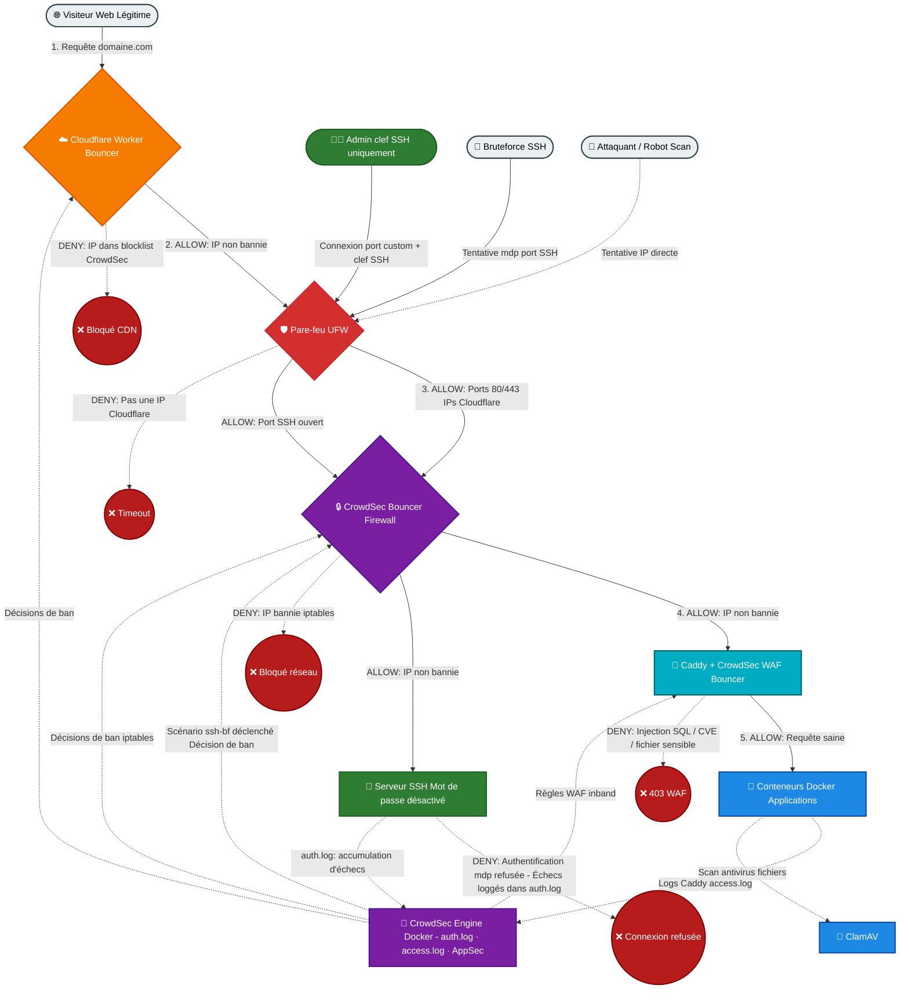
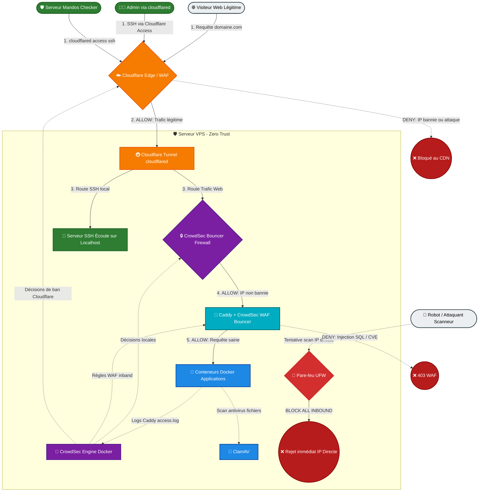

# 02 - Configuration et durcissement du serveur

## Les 4 points de sécurité

Voici les 4 piliers de sécurité à respecter

1. **Le Moindre Privilège** - Gestion des utilisateurs avancée : sudo impératif, retrait de connexion à l'user `debian`, root verrouillé.
2. **Le Security by Design** - Conception sécurisée de l'architecture en amont : [Cloudflare -> Caddy -> Docker] avant même de coder quoi que ce soit.
3. **La Défense en Profondeur** - Empilement de couches : Cloudflare + Pare-feu + CrowdSec Firewall bouncer + Clés SSH + Rkhunter.
4. **Le Zero Trust** - Cloisonnement : chaque service est un conteneur isolé passant par son `localhost`.

## La Checklist de sécurité

- [x] connexion uniquement par clef ssh (avec passphrase)
- [x] rkhunter pour détecter rootkit et backdoor
- [x] changement du port ssh par défaut
- [x] ajout d'un user supplémentaire (moi) avec accès sudo
- [x] pare-feu fermé par défaut pour tout sauf port SSH (et liste blanche d'ip CloudFlare pour http et https)
- [x] CrowdSec Firewall bouncer pour protéger mon port SSH
- [x] lock de l'user initial de la debian
- [x] verrouillage de la connexion ssh à root
- [x] gestion des logs
- [x] màj auto avec unattended-upgrades
- [x] la pare-feu bloque tous les ports, sauf le local host et le port ssh
- [x] le pare-feu a une liste blanche d'ip de CloudFlare, seules ces ip peuvent acceder à http et https
- [x] CrowdSec Firewall bouncer contrôle le pare-feu de CloudFlare via API, bloquant automatiquement les IP malveillantes
- [x] docker installé en mode standard, nécessitant sudo (pour éviter un hack depuis un conteneur)
- [x] gestion des logs docker
- [x] mise en place de reverse proxy avec caddy (avec CloudFlare) + paramétrage de CrowdSec WAF/AppSec sur caddy compilé avec CrowdSec Caddy Bouncer
- [x] déploiements via conteneurs docker (c'est caddy qui prend en charge la redirection des connexion entrantes vers les localhost des différents conteneurs)
- [x] TOTP ou 2FA sur mes comptes OVH VPS, Contabo VPS et CloudFlare
- [x] gérer un système d'alerte de crowdsec si un gros volume d'ip bannies
- [x] passer un SHA256 dans mes compose.yml au lieu de juste le numéro de version

## Gel forensique

Avoir un script pour récupérer, par priorité (pour le backup R2) :

1. **`/var/log/auth.log`** — connexions SSH, tentatives d'authentification, sudo
2. **`/opt/docker/caddy/logs/access.log`** — toutes les requêtes web qui arrivent sur ton VPS
3. **Logs CrowdSec** (`sudo docker compose -f /opt/docker/crowdsec/compose.yml logs`) — les décisions de ban, alertes WAF
4. **Logs de chaque container Docker actif** (`sudo docker compose logs` dans chaque dossier, ex: Penpot, Vaultwarden) — erreurs applicatives, activité suspecte
5. **`journalctl`** (logs système généraux) — un export avec `journalctl > journalctl_export.log`

En gros lancer manuellement le backup juste avant d'executer le Kill Switch.

## Représentation du flux entrant

Seules les connexions entrantes sont filtrées, toutes les connexions sortantes sont traitées par les conteneurs Docker (qui gèrent nativement iptables sur Debian).

Non, je ne l'avais pas pris en compte explicitement dans le diagramme. C'est une info importante car ça change la nature de la menace SSH : un attaquant qui tente un bruteforce de mot de passe va générer des échecs dans `auth.log` (tentatives de connexion avec mdp refusées par le serveur SSH lui-même), et CrowdSec va les détecter et bannir l'IP via le bouncer firewall.

Voici la version corrigée avec cette précision :

## Perspectives : Sécurité Applicative (Symfony & Docker)

Pour compléter ce plan de durcissement, la sécurité du code et des conteneurs sera validée via trois piliers indispensables :

1. **Le Scan Statique (SAST) :** Analyse automatisée du code source Symfony (via des outils comme PHPStan ou SonarQube) directement lors du `git push` pour détecter les failles logiques (injections, variables non nettoyées) avant la mise en production.
2. **Le Scan Dynamique (DAST) :** Simulation d'attaques en conditions réelles sur l'API en cours d'exécution (via OWASP ZAP) pour éprouver la résistance des routes et des formulaires face aux comportements malveillants.
3. **Le Contrôle des Dépendances (Indispensable Symfony) :** Utilisation systématique de la commande `local:check:security` de Symfony pour scanner instantanément le fichier `composer.lock` et bloquer le déploiement si une bibliothèque tierce contient une vulnérabilité connue.
*(Note : La mise à jour automatisée des images de conteneurs sera assurée par Watchtower).*

## Reste à faire (Perspectives de production)

Pour finaliser la mise en production du serveur et garantir une sécurité maximale lors du déploiement, les points suivants devront être configurés et respectés :

### 1. Règle de pare-feu UFW spécifique à Cloudflare

Lors de la configuration finale du pare-feu de la machine (UFW/iptables), restreindre le trafic entrant sur les ports HTTP (80) et HTTPS (443) pour n'accepter **que** les requêtes provenant des adresses IP officielles de Cloudflare.

- *Objectif :* Empêcher qu'un attaquant puisse contourner le proxy et le bouclier Cloudflare en attaquant directement l'adresse IP publique (et théoriquement cachée) du VPS.

### 2. Politique de sauvegarde applicative (Backup)

En complément des sauvegardes trimestrielles de Vaultwarden/KeePassXC, mettre en place un script automatisé de sauvegarde pour la base de données de l'application Symfony.

- *Objectif :* Externaliser quotidiennement ou hebdomadairement les données applicatives vers un espace de stockage distant et sécurisé, totalement indépendant du serveur principal.

### 3. Injection sécurisée des secrets (Zéro fichier .env en production)

Bien que l'usage d'un fichier `.env.local` soit la norme en phase de développement (avec exclusion stricte dans le `.gitignore`), bannir la présence de tout fichier `.env` physique sur le disque dur du serveur de production.

- *Fonctionnement :* Les variables sensibles (clés d'API, `APP_SECRET`, identifiants de base de données) seront définies directement au niveau du système hôte ou injectées via les secrets d'un outil de déploiement (CI/CD).

- *Configuration Docker :* Le fichier `docker-compose.yml` récupérera ces variables via l'interpolation (ex: `DATABASE_URL=${DB_PASSWORD}`) et les injectera directement dans l'environnement du conteneur au démarrage.

- *Objectif :* Garantir que les données ultra-sensibles ne vivent que dans la mémoire vive (RAM) des processus isolés de Docker. Même en cas d'accès SSH frauduleux aux fichiers du projet, aucun secret ne sera lisible en clair sur le stockage.

### 4. Supervision et Alerting : Notifications d'alertes Rkhunter par e-mail

Configurer un service d'envoi de mail local (comme `postfix` ou `ssmtp` configuré en relais SMTP sécurisé) pour permettre au système de communiquer avec l'extérieur.

- *Fonctionnement :* Paramétrer le fichier de configuration de l'outil (`/etc/rkhunter.conf`) via la directive `MAIL-ON-WARNING="ton-adresse@email.com"` pour lier le cron quotidien de Rkhunter à une boîte mail dédiée.

- *Objectif :* Être alerté instantanément en cas de détection de rootkit, de modification suspecte de fichiers système ou d'anomalie de sécurité (`WARNING`), évitant ainsi d'avoir un outil de détection passif qui tourne en tâche de fond sans supervision humaine active.

### 5. Maintenance et cycle de vie : Gestion des mises à niveau (Upgrades)

Planifier une routine de veille et de mise à jour majeure pour le framework (Symfony), le langage (PHP) et le système de gestion de base de données, au-delà des simples patchs de sécurité automatisés.

- *Fonctionnement :* Suivre la feuille de route (*roadmap*) de Symfony pour caler les montées de versions (par exemple, migrer d'une version mineure à une autre, ou planifier le passage à une version LTS - *Long Term Support*). Utiliser les outils de migration de Symfony (`maker-bundle` ou outils de dépréciation) pour adapter le code aux nouvelles normes.

- *Objectif :* Éviter l'obsolescence logicielle et la perte de support de sécurité (*End of Life*). Un système maintenu à jour régulièrement demande un effort minime à chaque étape, alors qu'attendre plusieurs années rend la mise à niveau complexe, risquée et crée une dette technique critique.

### 6. Gestion des accès de l'équipe (Identity and Access Management - IAM)

Appliquer une politique stricte d'accès nominatif et restreint pour les futurs collaborateurs ou développeurs devant intervenir sur l'infrastructure.

- *Accès SSH Nominatif (Zéro partage) :* Bannir le partage de clés SSH ou de comptes génériques. Chaque membre de l'équipe possède sa propre clé SSH publique, ajoutée manuellement par l'administrateur dans les `authorized_keys`. Cela garantit la traçabilité totale des actions dans les journaux système (`/var/log/auth.log`).

- *Refus du groupe Docker (Contre l'escalade de privilèges) :* Ne jamais ajouter un utilisateur standard au groupe système `docker` pour lui éviter l'usage direct de Docker sans élévation. Le démon Docker tournant en `root`, cette pratique permettrait une escalade de privilèges (possibilité de monter la racine du serveur dans un conteneur et d'en modifier les fichiers).

- *Privilèges Sudo et Révocation :* Privilégier l'attribution des droits `sudo` classiques (nécessitant le mot de passe de l'utilisateur) uniquement aux profils de confiance absolue pour les tâches de déploiement. En cas de départ d'un collaborateur, la révocation est immédiate et sans impact sur les autres via la simple suppression de sa clé SSH.

- *Objectif :* Maintenir le pilier du **Moindre Privilège** au niveau humain, assurer l'imputabilité des commandes lancées sur le serveur et bloquer les vecteurs d'attaques internes par contournement des droits système.
